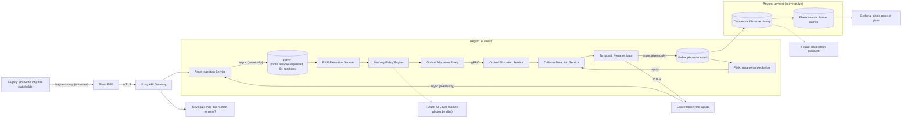

# Target State Architecture: Enterprise Media Asset Identity Lifecycle Platform

v0.7 DRAFT · Status: For ARB review · Owner: Principal Enterprise Architect, Office of the CTO · Contributors: TBC (delivery)

## Executive summary

This proposal establishes Naming-as-a-Platform: a governed, event-sourced capability for assigning, mutating and auditing the identity of media assets across the estate. The originating requirement was phrased as "I need to rename 40 photos on my laptop". That wording is regrettable, but it has been preserved in the event log, where it will stay forever.

## Non-functional requirements

| Attribute | Target |
|---|---|
| Availability | 99.999% (≈ 5 min 16 s downtime a year), per region, including while the lid is closed |
| Latency (p99) | < 20 ms per rename, globally |
| RPO / RTO | 0 photos / 30 s |
| Throughput | 1.2 million renames/s sustained (current demand: 40, once) |
| Data residency | EU, US, APAC, and the laptop, which has been reclassified as an edge region |
| Retention | Every former filename, forever, immutable |

## Guiding principles

1. Cloud-agnostic by default.
2. Event-first. A rename is something that happened, not something that is done.
3. No tactical solutions.
4. Filenames are a bounded context, not a string.
5. Humans never touch the filesystem directly. Humans caused the current filenames.

## Logical architecture

- **Asset Ingestion Service**: discovers photos on the edge region.
- **EXIF Extraction Service**: reads capture metadata and publishes it to the Naming Policy Engine, which ignores it.
- **Naming Policy Engine**: decides what a photo is allowed to be called.
- **Ordinal Allocation Service**: issues the numbers 1 to 40, idempotently.
- **Ordinal Allocation Proxy**: calls the Ordinal Allocation Service.
- **Collision Detection Service**: makes sure no two photos become `IMG_0001`.
- **Rename Saga Orchestrator**: coordinates the rename, with a compensating rename back if it fails.
- **Filename History Read Model**: the CQRS projection of what each photo used to be called.

## Diagram

Legend: blue is strategic, amber is tactical (deprecated), grey is owned by delivery.

## Technology choices

| Component | Technology | Justification |
|---|---|---|
| Rename events | Apache Kafka | A replicated commit log with replay, so any rename can be repeated indefinitely. 64 partitions give each photo 1.6. |
| Rename coordination | Temporal | Replays workflow code from its event history, so the rename survives a crash of the laptop it runs on. |
| Reconciliation | Apache Flink | Event-time windows detect when the stakeholder has stopped dragging photos. |
| Filename history | Apache Cassandra | Masterless replication built for heavy write loads. 40 writes is a heavy write load spread thin. |
| Former-name search | Elasticsearch | Inverted indexes over `IMG_4417.JPG`. |
| Service-to-service | Istio | Envoy sidecars give mTLS between the Ordinal Allocation Service and its proxy, which run on the same node. |
| Identity | Keycloak | OIDC for one user, plus SSO into nothing. |
| Infrastructure | Terraform | Declares three regions in HCL. The laptop is out of state and has been flagged. |

## Rejected alternatives

The stakeholder proposed Finder's built-in batch rename: select all 40, right-click, Rename. Nearby, someone also proposed a shell for-loop. Both were rejected as tactical, as not scaling past 40, and as having no clear ownership model. Finder writes no events and has no SLO, and it does not let anyone replay a rename. It is a very natural first instinct. Most instincts are.

## Risks

| Risk | Mitigation |
|---|---|
| R1: Collision between two `IMG_0001` | Collision Detection Service, reconciled by Flink, reconciled again by Flink |
| R2: Edge region closes its lid | Multi-region active-active. The photos stay on the laptop. |
| R3: Kafka consumer lag exceeds the total number of photos | Add partitions |
| R4: The requester (tactical mindset; renames things by hand) | Keycloak RBAC; Legacy node kept behind the BFF |
| R5: Stakeholder expectation of delivery | Socialisation |

## Indicative cost

$37,480/month excluding egress of 40 JPEGs, which is lean. Licensing TBC with Procurement, who have been informed and are thrilled.

## Roadmap

| Phase | Scope | Duration |
|---|---|---|
| 1. Foundations | Clusters, mesh, IaC, Kafka, an on-call rota for the Ordinal Allocation Proxy | 18 months |
| 2. Platform | Naming-as-a-Service, onboarding of the first tenant (the laptop) | 9 months |
| 3. Re-platform | Migration off the Phase 2 platform onto the target state | 12 months |
| 4. Business value | The 40 photos are renamed | Month 41, indicative |

I have booked the ARB slot. It is in March.

## Next steps

1. Raise ADR-0001: "Photos are events."
2. Socialise with stakeholders.
3. Book a follow-up ARB slot to review the March slot.
4. Ask the delivery teams to keep the photos as they are until Phase 4.
