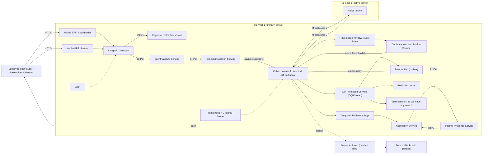

# Target State Architecture: Household Consumables Demand Orchestration Platform

v0.7 DRAFT · Status: For ARB review · Owner: Principal Enterprise Architect, Office of the CTO · Contributors: TBC (delivery)

## Executive summary

The stakeholder asked for "a shared shopping list for me and my partner". It is regrettable that the requirement was worded as though it were small. What the household needs is Demand-Signal-as-a-Platform: capturing, reconciling and fulfilling household intent across two concurrent, unsynchronised writers who have each, independently, bought oat milk.

## Non-functional requirements

| Attribute | Target |
|---|---|
| Availability | 99.999% (≈ 5 min 15 s a year), per aisle |
| Latency (p99) | < 20 ms from "we're out of eggs" to durable commit, car park included |
| RPO / RTO | 0 s / 30 s. A forgotten item is a data-loss incident. |
| Throughput | 4.2 million `ItemAdded` events/s, sustained (Sunday 18:00 peak) |
| Data residency | EU, US, APAC, and the partner's mother's house |
| Retention | Forever, immutable. "Who finished the cheese" must still be answerable in 2041. |

## Guiding principles

1. Cloud-agnostic by default.
2. Event-first. Milk is an event, not a row.
3. No tactical solutions.
4. Humans are read-only.
5. Every item has an owner, and the owner is never the person who finished it.

## Logical architecture

- **Intent Capture Service**: accepts a claim that something is needed. It does not believe the claim.
- **Item Normalisation Service**: resolves "milk", "Milk", "the milk" and "MILK!!" to one SKU.
- **Duplicate Intent Arbitration Service**: decides who added the eggs first. Consistency is eventual. The argument is immediate.
- **List Projection Service**: the CQRS read model, which is to say the list. It is not authoritative.
- **Fulfilment Saga Orchestrator**: runs `InBasket → Bought`, with the compensating step `ReturnedToShelf`.
- **Notification Service**: calls the Partner Presence Service.
- **Partner Presence Service**: calls the Notification Service.

## Diagram

Legend: blue is strategic, amber is tactical (deprecated), grey is owned by delivery, and red is the stakeholder.

## Technology choices

| Component | Technology | Justification |
|---|---|---|
| Intent log | Apache Kafka | Records are retained and replayable, so any dispute over whether eggs were on the list can be re-run from offset 0. |
| Dedup | Apache Flink | Event-time windows with exactly-once state. Two people adding "milk" four minutes apart produce one milk, provably. |
| Saga | Temporal | Replays the workflow from event history, so a shopping trip survives the phone dying in the frozen aisle. |
| Mesh | Istio | mTLS between services, so Normalisation can trust Intent Capture, which is more than the household manages. |
| Identity | Keycloak | OIDC and SSO for two users who already share a streaming password. |
| Search | Elasticsearch | Lucene inverted indexes over a corpus of eleven nouns. |
| Runtime | Amazon EKS, Amazon MSK, Aurora PostgreSQL | Cloud-agnostic. |
| IaC | Terraform | Plans the diff against a state file. The household has no state file, which is the root cause. |

## Rejected alternatives

- **A shared note in a phone notes app.** The stakeholder proposed this. It is a very natural first instinct, as most instincts are. It has no audit trail, no SLO, no RBAC and no future. It is also already in production in the household, which is exactly the concern.
- **Paper on the fridge.** Single-region and unreplicated, one magnet away from total data loss.
- **Shouting "we need milk" across the flat.** Event-first, admittedly, but with no durability and no consumer offsets.

## Risks

| # | Risk | Mitigation |
|---|---|---|
| R1 | Split-brain: both partners buy milk | Widen the Flink dedup window to 24 h |
| R2 | Unresolvable items ("the usual", "that thing from last time") | Item Normalisation Service; Future: AI Layer |
| R3 | The partner, unconsulted, keeps texting items | Change programme; text messages declared non-authoritative |
| R4 | Stakeholder expectation of delivery | Roadmap socialised early and often |
| R5 | Requester (role: household member, tactical mindset) | Read-only access from Phase 2 |

## Indicative cost

$23,870/month across two regions, excluding egress and groceries. This is lean.

## Roadmap

- **Phase 1, Foundations (18 months):** landing zone, Terraform modules, Kafka, the Keycloak realm.
- **Phase 2, Platform:** Normalisation, Arbitration, the Saga.
- **Phase 3, Re-platform:** migration off Phase 2.
- **Phase 4:** the list, in month 31.

I have booked the ARB slot. It is in March.

## Next steps

1. Raise ADR-0001: "Milk is an event, not a row."
2. Socialise with stakeholders, including the partner.
3. Book an ARB slot. Until then the stakeholder may keep using the fridge, which has been logged as tactical.
